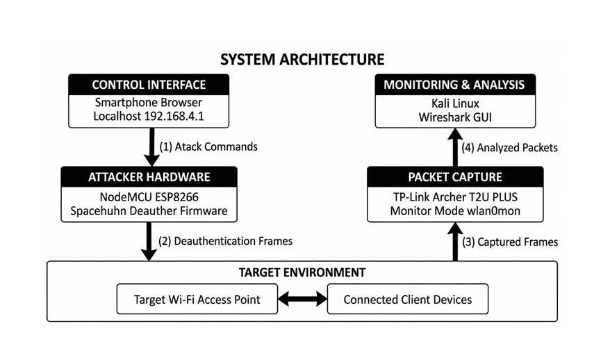

# Wifi-deauth-analysis
# 📡 Wi-Fi Deauthentication Analysis using NodeMCU

## 🔍 Overview
This project demonstrates IEEE 802.11 deauthentication attacks using NodeMCU ESP8266 and analyzes captured packets in monitor mode using Kali Linux and Wireshark.

## ⚠️ Disclaimer
This project is for **educational and research purposes only**. All experiments were conducted in a controlled and authorized environment.

## 🛠 Tech Stack
- Kali Linux
- ESP8266 (NodeMCU)
- Arduino IDE
- Wireshark
- Monitor Mode (RTL8821AU)

## 📊 Key Features
- Deauthentication frame generation
- Monitor mode packet capture
- Wireshark packet analysis
- Frame-level inspection (MAC, subtype, reason codes)

## 🏗 Architecture

##Node MCU

##tp-link archer t2u plus

